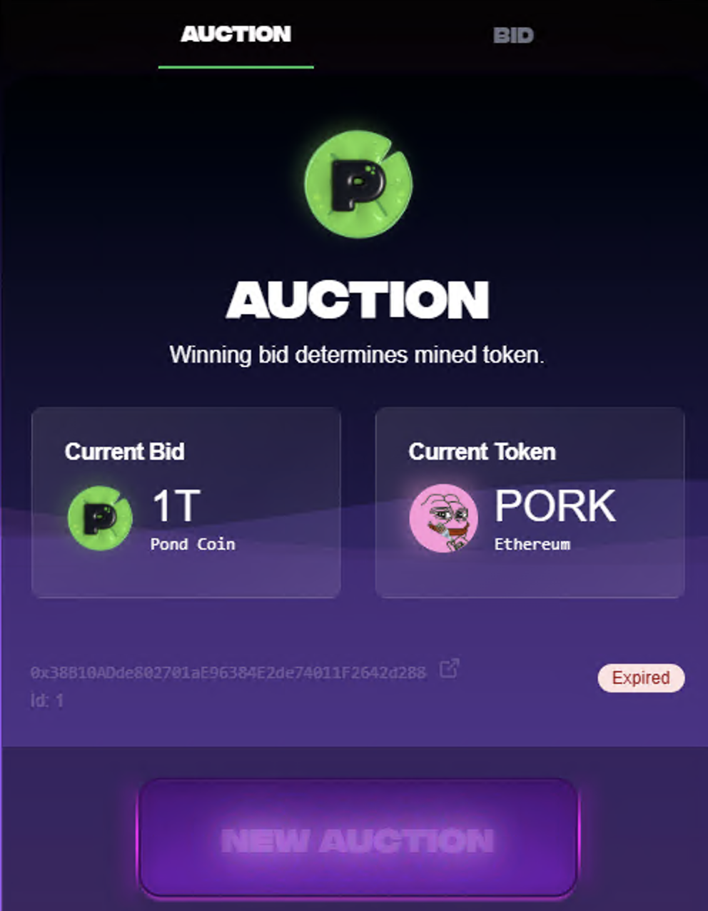
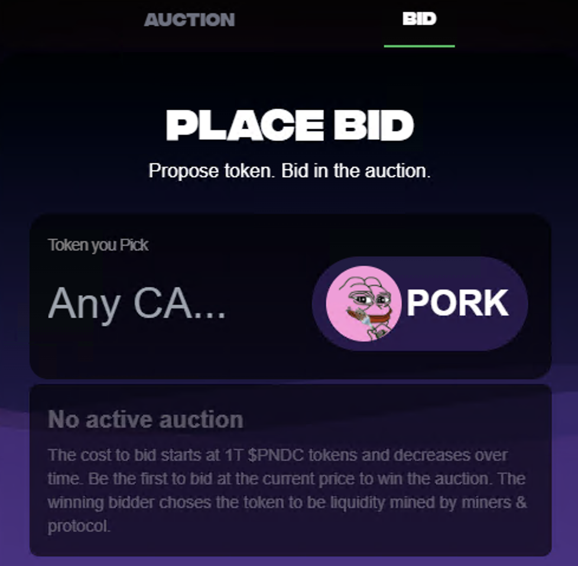

# Auction

https://www.pond0x.com/mining/bid (currently unlisted)

The Auction is a way for you to rent the mining power of Pond0x to receive mining fees and suggest the token that is mined.

> **How does it work**\
> During active auctions anyone can suggest a token and bid PNDC on that token to be mined.\
>When that token is mined fees from hash boosts, rig activations and swaps are collected.\
>50% of the mining fees collected from mining the winning bid amount is sent to the winning bidder.\
>The other 50% of the mining fees collected from mining buys (liquidity mines) the winning token of the auction.

> **What is the minimum bid?**\
> The auction starts at 1T PNDC and decreases over time.\
> Be the first to bid at the current price to win the auction.\
> The winning token is liquidity mined by miners.

> **What token can I bid on?**\
> Any SPL or EVM token that has liquidity.\
> (Examples include: PNDC, Pork, PEPE, WIF, wPOND, FartCoin)

> **What happens to the mined tokens?**\
> Mined tokens are distributed as Spawn rewards.

> **What currency does the winning bidder receive the mining fees in?**\
> SOL.

https://github.com/Pond-Foundation/Liquidity-Mining-Auction

There is a Readme file with an overview as well as a draft of the Solidity contract.

>The Liquidity Mining Auction implements a recurring Dutch auction system with integrated permissionless fee distribution. The module manages sequential 42-hour auctions where participants can propose tokens to be liquidity mined by making a bid using PNDC, resulting in winners having the ability to claim mining fees accumulated from mining activity. The token of winning bid is mined until next auction ends.

### How It Works
1. **Dutch Auction**: The price starts high and drops steadily over time. User pay in Ethereum $PNDC.
2. **Place Your Bid**: When a user is willing to pay the current price and places a bid, they win.
3. **Token Leader**: The network and token of the winners choosing become the Token Leader. The protocol buys this token and adds it to the spawn token reward wallet.
4. **Claim Rewards**: Winners can collect fees from the auction pool powered by mining.
5. **Repeat**: The first valid bidder wins, and a new auction starts immediately.

When the Token Leader tokens are the greatest in the reward wallet, the become the reward for spawning.

This system incentivices Market Makers to pay for their favorite tokens to be mined. The buying power and distribution of their tokens will be vast.

I very much look forward to seeing this in action.