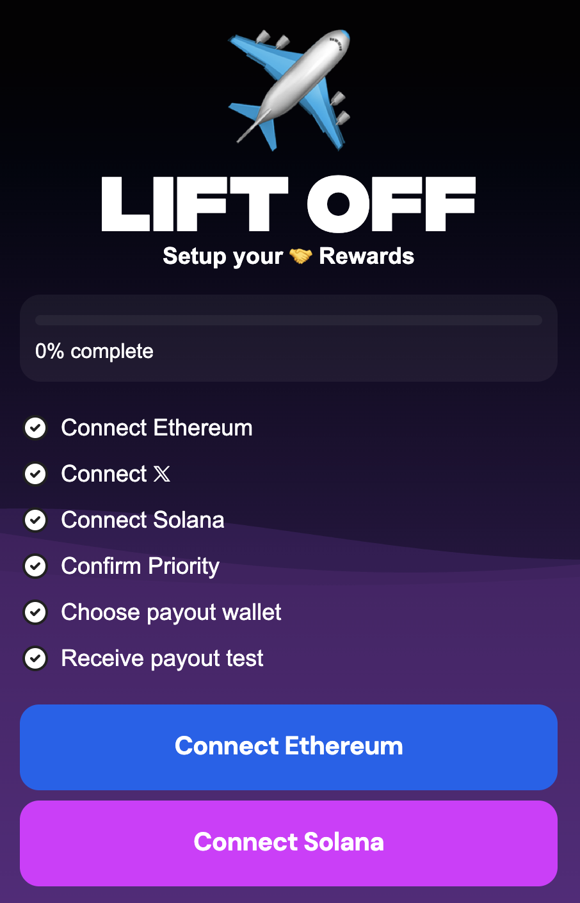

# Check In

> **Setup**. Configure your wallets to connect cross chain.\
> **Lift off**. Begin streaming your rewards.

> **What is Check In?**\
> Confirms your rewards are sent to the correct destination on the right chain.
> To Mine, you need to Check In so rewards can be sent to you.

> **What is Priority?**\
> The order in which rewards are prioritized for sending.\
> If you do not complete Check In, your priority might change.

> **When can I Mine?**\
> Once the Check In window has completed, Mining begins. You will need SOL to Mine.

> **What is a Payout Test?**\
> You will receive a small payout on the destination chain to confirm where you will automatically continue to receive rewards.\
> Your Check In will be complete once you receive this amount.

I am not sure that this payout test is still being sent out. I would not wait for it to arrive to begin mining.

> **Can I use my badges?**\
> Once you Check In, you can Teleport (⚡) your badges to Solana.

The multiple-wallet linking feature is not yet available.

---

Checking in is relatively straightforward. As long as you have Eth and Sol wallets and some Sol, you should be good to go. Simply follow the on-screen prompts.

## Notes

The payout test may not be sending out anymore. Do not wait for it to begin mining.

If you want to connect your X account, do not skip that step. There is no way to do it afterwards at the moment.

Since the check in is not fully completed, I am not sure teleporting badges will work. This should likely get resolved once the test send is restored or removed as a requirement.
