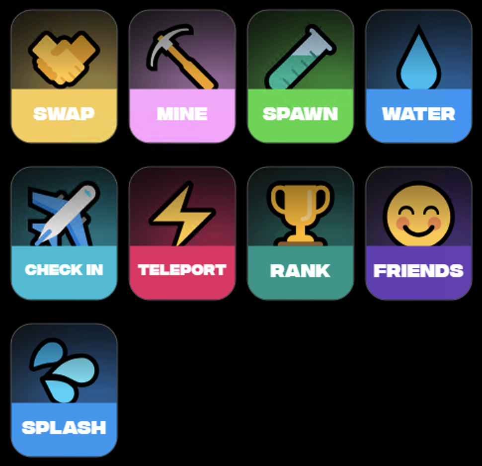

# Pond0x Overview

Pond0x is an ecosystem that is broken up into various segments.  They all generally work together in one way or another.

## [✈️ Check In](checkin)
>**Setup**. Configure your wallets to connect cross chain.\
>**Lift off**. Begin streaming your rewards.

The first thing you will want to do is check in.  This is basically like creating an account.  This pairs your Eth, Sol, X, etc. accounts into one.

## [⚡️ Teleport](teleport)
>**Teleport**. Spawn your PNDC. Get PEPE, PORK, MOG and more\
>**Use Link**. Get rewarded when others use your link.

The second thing you will want to do is teleport any badges you may have from your Eth wallet to your Eth/Sol/Pond0x pair.  This is optional and will not do anything for anyone brand new to Pond0x

--

From here, you are ready to start interacting with the protocol.

## [⛏ Mine](mine)
>**Mine on Solana**. Now you can mine on Solana.\
>**Use Link**. Get rewarded when others use your link.\
>**Boost**. Boost your mining output.\
>**No limits**. No min or max for PRO users.

The Mining page allows you to use your system as a miner by solving and validating hashes in exchange for $wPond rewards.  It sounds complicated, but in two clicks you can call yourself a crypto miner.

## [🤝 Swap](swap)
>**Swap on Solana**. Real time rewards.\
>**Swap on Ethereum**. More swaps. More Drops.\
>**Use Link**. Get rewarded when others use your link.

The Pond0x Swap is among the best swaps available.  While it does have a tiny fee, it has great options and produces rewards for swappers, especially using referral codes (see Friends).

## [😊 Friends](friends)
>**Earn Rewards**. When your friends swap.\
>**Earn Rewards**. When your friends mine.\
>**Use Link**. Get rewarded when others use your link.

The Friends page will give you a swap referral link that you can share with your friends. Swapping on referral links produces swap rewards that is shared among friends.

## [🏆 Rank](rank)
>**Top Token Pools**. Distributed as results.\
>**Add to Pools**. Earn more real time.

The Rank (Leaderboard) page allows you to burn tokens for luck and to push the needle on the next Spawning event.  You will likely need to understand more about the full ecosystem to understand this.

--- 

## Soon

These features are unreleased, but some details are known.

## [🧪 Spawn](spawn)
>**Spawn on Solana**. Spawn your PNDC. Get PEPE, PORK, MOG and more\
>**Use Link**. Get rewarded when others use your link.

The Spawn page is where you participate in the Spawning events. These are triggered by mining claims and only last for a short amount of time.  Major rewards can be won here.  Unique speculation options also exist here.

## [💧 Water](water)
>**Get SOL**. Lock PNDC, earn SOL from mining, LP and swaps.\
>**Flexible**. Unlock Anytime. No contract locks.\
>**Boost**. Lock longer, earn more SOL.

The Water page allows you to lock $wPond for an amount of time in exchange for a stream of Sol.

## [🤌 Predict](predict)
>**Tokenize**. Trade highly-debated topics.\
>**Earn Rewards**. When your friends make predictions.

The Prediction page appears to be a place to place an A/B wager on real world events like elections and sports events.