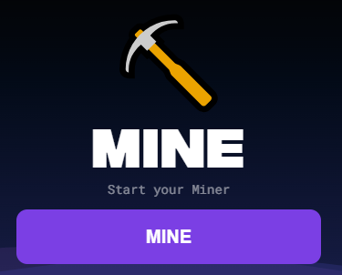
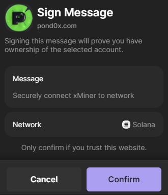
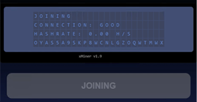
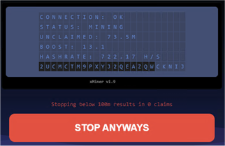
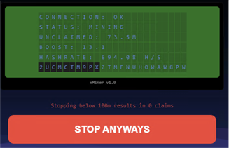
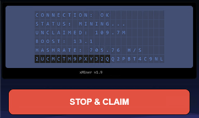
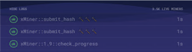
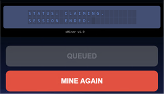
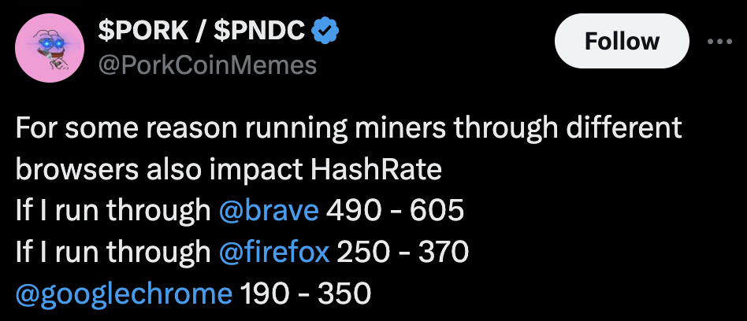

 
# Mining Guide v2.0

(Some of the images still say v1.9, they are more or less the same as before.)

This guide assumes you have [Checked In](/docs/guides/checkin) and have at least your Solana wallet attached.

## Stage 1. Mine

Wait at least 10 seconds before mining. The manifest needs to settle.\
Click [**MINE**].  This will open a Solana signature prompt.  This does not cost anything.

---

## Stage 2. Sign

Confirm quickly (but safely).  It should look identical to the image above.\
Timing out the wallet request will bone you and you will have to refresh.

---

## Stage 3. Joining

This screen should only appear for a moment. If it persists, you are boned and need to refresh. (This does not happen very often on v2.0)

---

## Stage 4. Status: Mining < 100M Unclaimed

You are now mining. As long as your hash is positive, wait for green flashes. \
If the hash goes to 0 hash while you are still under 100M, you are boned and need to refresh.

---

## Stage 5. Status: Mining < 100M Green Flashes

Green flashes are mining and validating events. As long as your hash stays positive, you are almost there!

---

## Stage 6. Status: Mining > 100M

You can now claim your tokens any time. As long as the hash is positive, you can wait and let it mine more.\
Click [**STOP & CLAIM**] when ready.

---

## Stage 7. Status: Mining > 100M Color Flash

- Green is good. This is validating / mining.  This confirms you are actively mining.
- Red is bad. This is SLASHING from high hash rate or cheating.
- Yellow is warning. This is DRIFTING from communication issues.

---

## Stage 8. Mining Log

Green = Good.\
Red = Bad.\
The logs will tell you the previous 10 actions, such as rig_initialized, connected, peer_join, network_full, submit_hash, reconnecting and check_progress.It will help you debug any issues.\
One red event does not always mean failure.

[Mining Log Information](/docs/guides/mine/guide#mining-log)

---

## Stage 9. Claiming

Cross your fingers, say your prayers. With any luck, you have now successfully mined. You should see your wallet in the claim Queue. Now, go do it again!

---

## Additional Information

### Mining Log

- **Rig_initialized** – The mining rig has received the initialize command. This starts up the miner that your browser will use.

- **connected** – The peersx channel has successfully connected.

- **peer_join** – Your information is being broadcasted to the peersx channel, allowing you to be listed as an active miner.

- **check_progress** – Your browser receives updates from the server about progress, including unclaimed amounts, boosts, status, and more.

- **submit_hash ⛏️⛏️⛏️** – Submitting successful work (a validated hash) for the network to confirm.

- **network_full** – The peersx channel is too busy and has timed out.

- **reconnecting** – The peersx channel was closed unexpectedly; an attempt to reconnect is being made.

### Tips

Here are a few tips for success:

- There are two main strategies for claiming:
  - Claim early and claim often.  This seems to have been a great strategy for v1.7-1.9, but I see fewer people doing this now.
  - Wait until 0 hash to claim.  This seems to maximize claims and minimize the amount of time you spend clicking buttons.  It was also said that claims burn out your rig, not claim amounts, so this route seems safer.

- There are two main strategies for repeated mining:
  - Wait 20 minutes between mines.  H said that this is time programmed amount of time to fully cool down a rig.  He also said that if you have super high boost (400 was his example), that it is probably unnecessary.
  - Mine as soon as possible.  I see more people doing this, but I am not sure about the success rate or long term effects.

- Hash rate:
  - If the hash rate goes too high, you will absolutely get slashed.
  - 200-400 hash rate seems to be ideal range to mine without fear of slashing.

- If you don’t see any of the following for more than 5-10 minutes, you are boned-> Refresh:
  - Green logs (submit_hash, etc.)
  - Gree flashes

- Being stuck at 100k/1m unclaimed was very common on v1.9.  It seems to be less of a problem now.  If you suspect you are stuck, check your logs.  It is almost never a problem now.

- To increase hash:
  - Close everything but Pond0x
  - Open Queue tab
  - Pause the background video
  - Close the Inspector

- To decrease hash:
  - Open the inspector (NOTE, YOU DO NOT NEED TO ADD ANY CODE OR CLICK ANYTHING HERE. THE INSPECTOR CAN GET YOUR REKT)
  - Open the Mining tab
  - Play the background video (I recommend [Dustin's BiNGE MODE playlist](https://www.youtube.com/playlist?list=PL6jfERJYHKhwWarzfM6DsAxF-zqJbT2MD))
  - Open other windows
  - Play YouTube Videos
  - Throttle in Inspector Network tab (NOTE, DO NOT USE THIS UNLESS YOU UNDERSTAND WHAT IT IS DOING. THE INSPECTOR CAN GET YOUR REKT)

- Using various browsers may also help you find the exact hash you want.

  