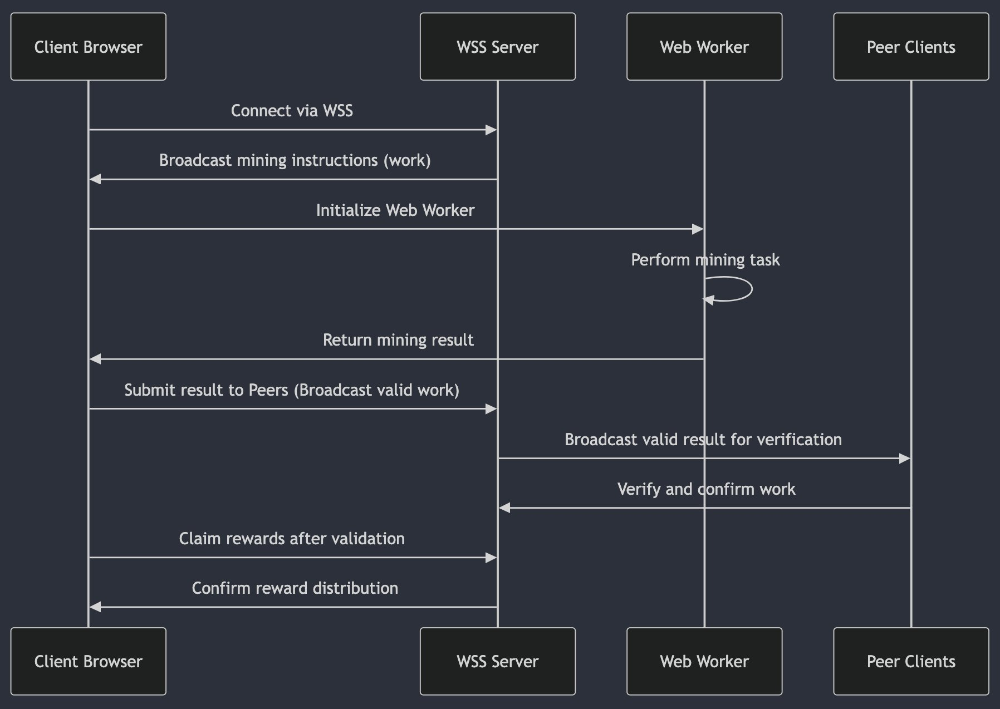

 
# Mining

>**Mine on Solana**. Now you can mine on Solana.\
>**Use Link**. Get rewarded when others use your link.\
>**Boost**. Boost your mining output.\
>**No limits**. No min or max for PRO users.

## FAQ

### Logged Out

>**When can I mine?**\
>Once check in window has completed, mining begins.\
>You will need SOL in order to mine.

>**Proof of work Mining?**\
>Valid canonical consensus - solvers produce blocks that ensure supply of tokens and liqudity on Solana is sourced and linked to the canonical supply on Ethereum.\
>Mine from any laptop, phone, or computer. You don't need to buy advanced hardware or have a software degree to get started.

>**Reward Halving?**\
>Periodic event that reduces the reward amounts by 50%.

>**What is Difficulty?**\
>The level that is auto adjusted, based on demand. This determines the computational challenge associated with mining.

>**Boost**\
>Boost your mining rigs performance by increasing it's hash rate. Greater hashrates allow your rig to earn more rewards.

Boost maxes out around 615. It used to be 415, then 515. It increases by 100 every cycle (x number of claims sent out?). 

A mining session gives you -3 boost. It will never display lower than 0, but it will technically be negative.

A swap gives you +0.16667 (1/6) boost.

The boost formula appears to be: Boost from badges + boost from swaps + boost from buying boost - boost lost from mining sessions.

>**Are the rewards sent automatically?**\
>Once you activate a claim from your mined activity, your rewards are automatically distributed to you.

### Logged In

>**Why does it say "Joining..."?**\
>It's connecting you to a new slot to mine or it's syncing to your most recently active slot (which can take time).

>**How long for Boosts to register?**\
>Boost transactions must be mined to register. Once these transactions are finalized they appear almost instantly.

>**My transaction is still pending, why?**\
>If your transaction is pending for long period of time, it has drifted. It can't be mined because it is out of range, it will be settled by the network on the next reward halving (every 500 blocks or 12,500 transactions).\
>With PRO your transactions are always prioritized in every block built by the Pond specific nodes.

>**What is an ATO?**\
>Abstract transaction object.\
>Block streaming produces new blocks every 25 transactions broadcasted to any chain observed by the engine. To compensate for the different transaction formats (i.e. calldata vs instructions) the transactions are shipped using an abstract format for compatibility.

## Notes

Mining is one of the main features of the Pond ecosystem. This uses Argon2 PoW within the browser to produce hashes that yield wPond rewards.

Rewards seem to be on slow-mo right now. They are certainly being sent out, but the delay is quite long.

Spawning is supposed to supercharge the claims and get them sending out quickly again.

The Claimed amounts are pegged to dollar values, so they will fluctuate as the price of wPond fluctuates. E.g. 20B for $1000 or 10B for $1000.

## Details

I believe that mining within the browser works something like this:

