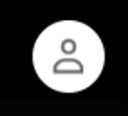
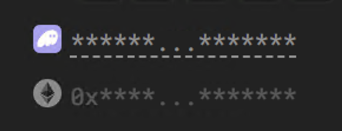

# Passport

- Click on your pfp (of lack thereof) at the top right on most pages

- Your passport will pop in from the bottom
- Click on your Solana address

- Wallet management menu opens  
 
From here, you can: 
- View your linked wallets 
- Add or remove connections 
- Go to swap 
- Go to clean your wallet 

✅ This includes linking your SOL and your ETH wallet, all under one Passport