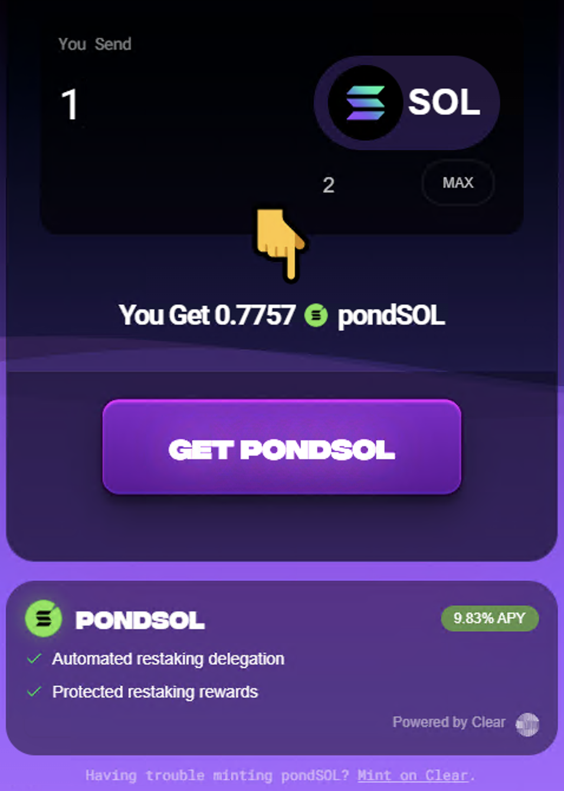

# pondSOL

https://www.pond0x.com/pondsol (not currently listed)

PondSOL is a Liquid Restaking Token.

On Solana, transactions are confirmed using Validators. These Validators must have SOL staked as collateral. The Validators are rewarded in SOL for doing work (validating, voting, etc.). Instead of buying and owning an entire Validator, users can pool their SOL int Validators and split the rewards. Liquid Staking Tokens (LSTs) tokenize that process so simply holding a token makes you eligible for rewards.

Liquid Restaking Tokens (LRTs) are LSTs that restake yield to boost APY via exchange rate appreciation.

E.g. mSOL APY 8.20% + Clear 1.63% boost = **9.83% APY**

You can stake SOL into pondSOL on the website. If you want to unlock, you can currently only do it on the Clear website.