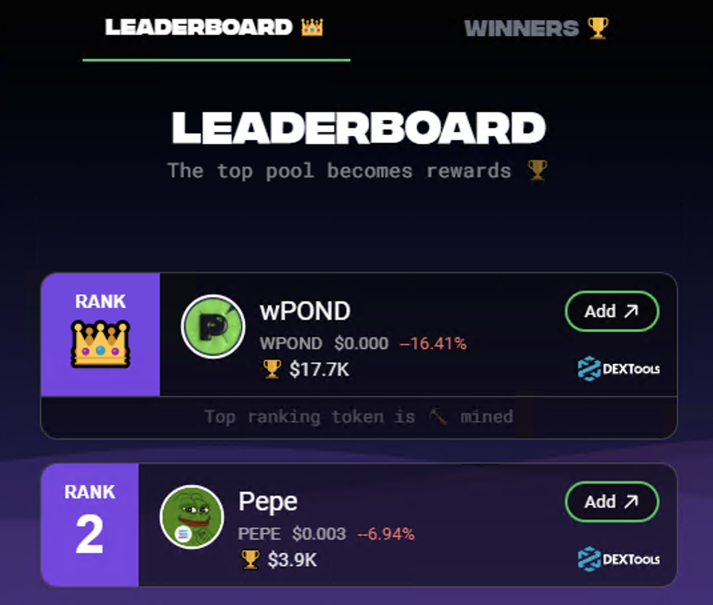
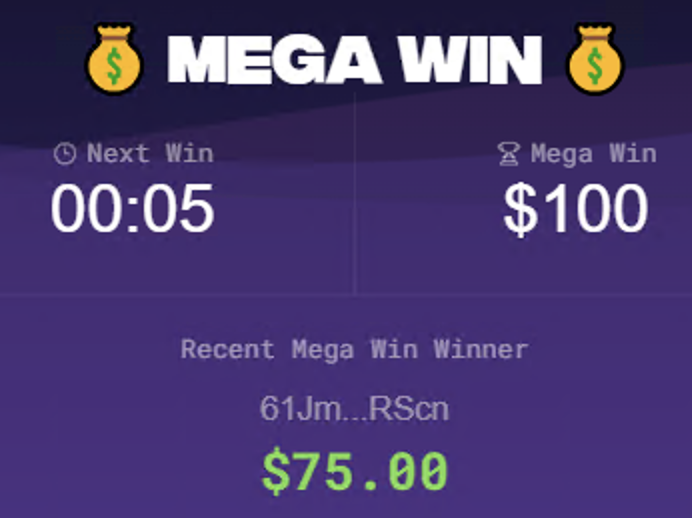
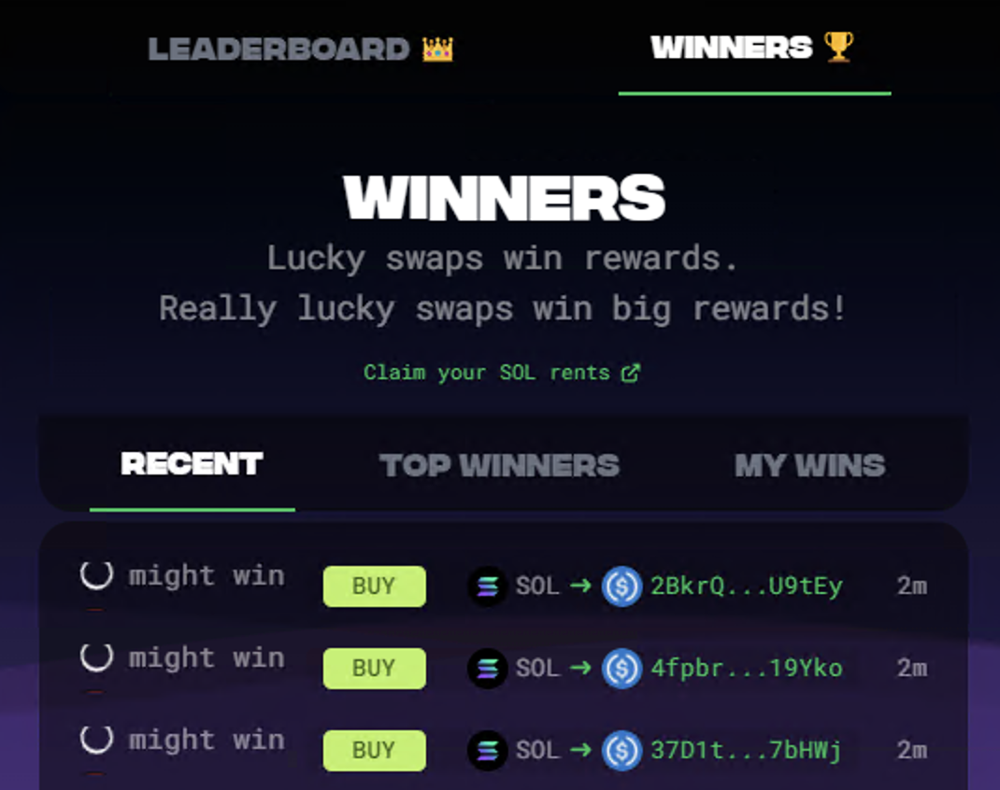
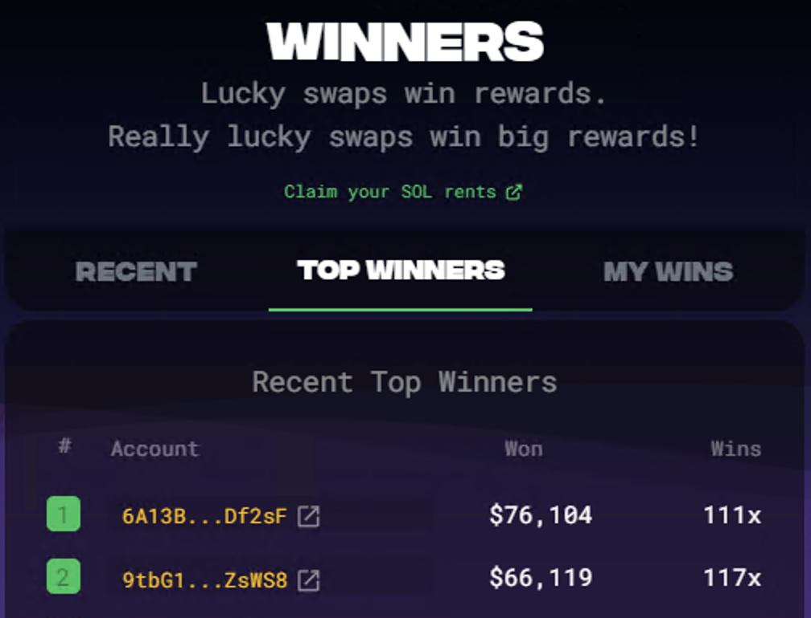
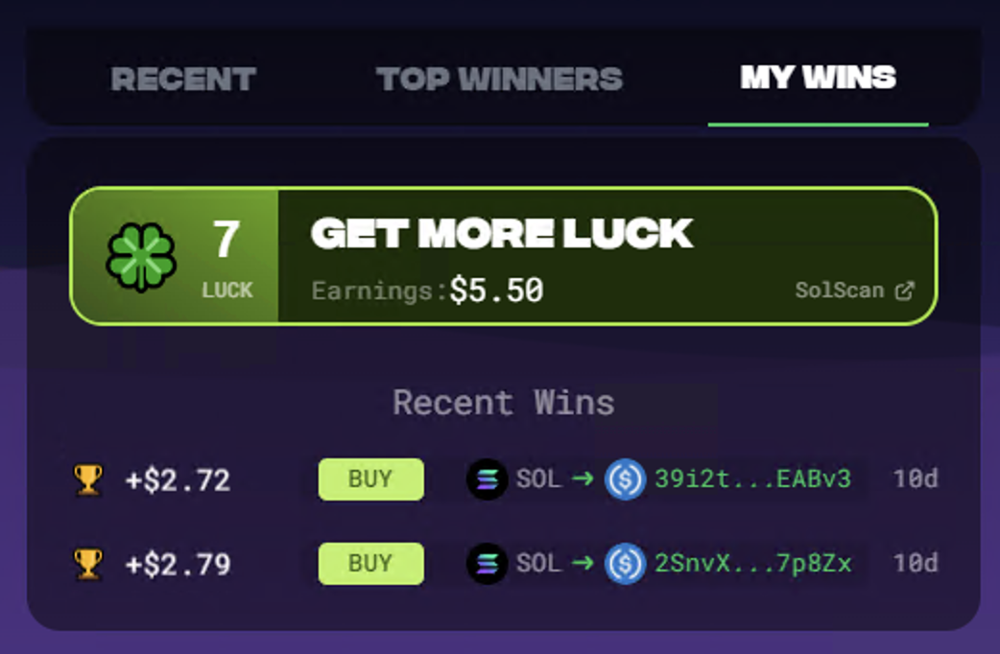
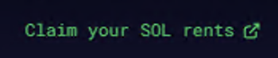
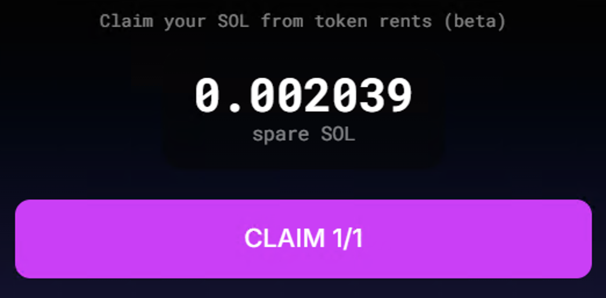

# Rank

>**Top Token Pools**. Distributed as results.\
>**Add to Pools**. Earn more real time.

## Leaderboard

The leaderboard is where you can "burn" tokens and view the most burnt tokens during this cycle. "Burnt" tokens are actually sent to a collection/distribution wallet.

Burning tokens also increases your luck.  I believe 10 is the current maximum.

The token leaders of these burn cycles will be rewards for spawning.  The idea here is that users will "burn" their favorite tokens in an effort to get huge amounts of buying power to raise up the rest of their bags.

E.g.: A dev on a pump fun coin project could promise a large percentage of their initial purchase to be burnt into the pond ecosystem.  Buyers would then know that 1) they can't get rugged if the tokens are locked, 2) huge amounts of buying power could send that coin to the moon.  If there is competition for that top slot, more users will buy and burn, resulting in a powder keg.

(I am personally more bullish about this feature than anything else about the pond ecosystem.)

## Mega Win

This section seems to have more to do with swapping than burning.  If I understand it correctly, swapping within these countdowns makes you eligible for the giga win.

## Winners

This tab will show you the recent, top, and your personal wins.  It also shows you your luck.

### Recent Winners

## Top Winners

## My Wins

## Claim Your SOL Rent

This little link is easy to overlook.  If I understand it correctly, this releases all of the token rents from your associated token accounts (ATA).  Basically, every unique token on your account is held by a ATA and each of them requires a ~.002 Sol rent.  When you swap out of that token, you can get that rent fee back.  Pond0x is kind enough to give you a sweet interface for getting all of that rent money back.

