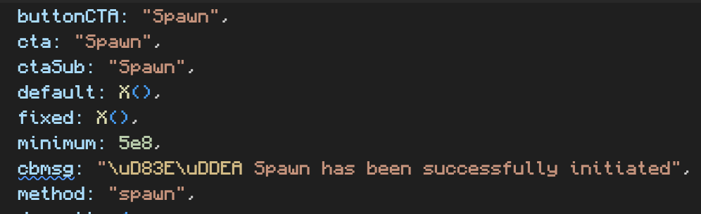

# Spawn

>**Spawn on Solana**. Spawn your PNDC. Get PEPE, PORK, MOG and more\
>**Use Link**. Get rewarded when others use your link.

Spawn converts wPond into the leaderboard mined token(s) on a scale.

Spawning events are supposed to happen with every successful 5,000 claims.

We are told that once it starts, it will happen at every 5,000 claims.

The Dune Dashboard has us at over 36,000 claims, so this should imply that there will very quickly be 3 more spawns after the first one.

From what I can tell, this curve represents awards which implies that the first few will giga win.

>**What is Spawning?**\
>A way to turn your mined activity into other tokens.\
>Spawning is not a swap.

>**How can I be prioritized?**\
>Priority is first come, first serve.\
>Optional tips increase priority. Tips are shared to Pondwater.

>**How do I choose which token I receive when spawning?**\
>You do not choose. You get whichever token has the highest supply at the time of your spawn.

>**What tokens can I get for Spawning?**\
>You get whichever available token has the highest supply.\
>Advanced:\
>Spawning runs on a registry. Tokens in the registry are liquidity mined proportionate to the weight of their registered PNDC.\
>Every 1T PNDC used to register a token receives ~5% of the mined liquidity during that mining cycle. (i.e: 3.25T PNDC used to register BTC, results in ~15.75% of mining directed to BTC. The BTC can be spawned when that mining cycle ends. The BTC will not be mined in the next cycle unless its registered again.)

## Info

Spawn has a minimum 500M wPond.

Spawn will only let you select 25%, 50%, or 100% of your wPond to transact. If any of these results in under 100M, it will not work.

## Issues

From the screenshot above, there is a conversion error using `toLocaleString()` to any location that does not use commas like "$1,000".

To resolve this, set your browser settings to US English. It has been reported to the team, so it should be fixed before the next Spawn.

