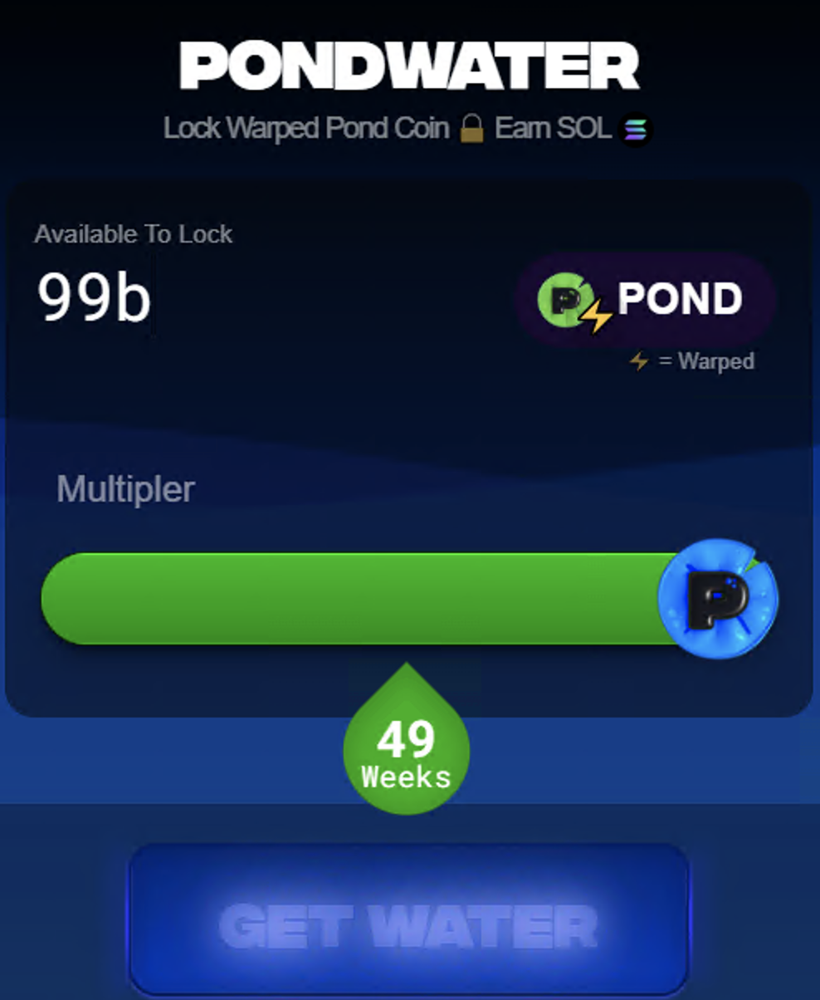
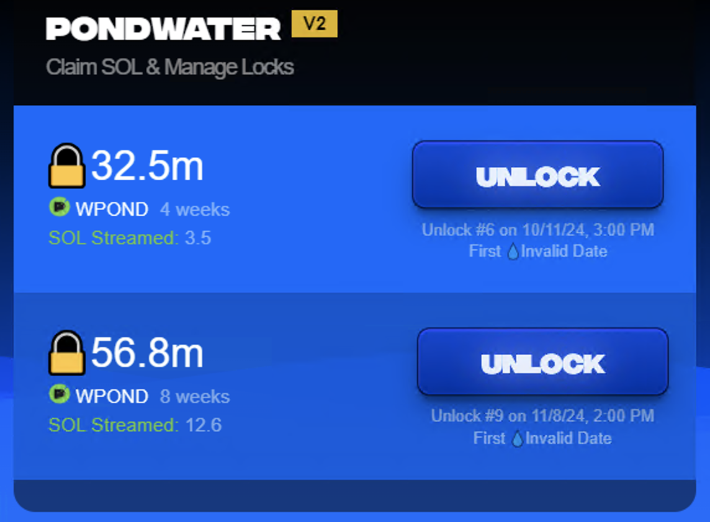

# Water



>**Get pondSOL**. Lock PNDC, earn pondSOL from mining, LP and swaps.\
>**Flexible**. Unlock Anytime. No contract locks.\
>**Boost**. Lock longer, earn more pondSOL.

## Lock

This feature is not yet available.  This feature will allow you to lock your wPond for several weeks and yield Solana over time.

>**How does it work?**\
>Lock warped ⚡️ PNDC and receive pondSOL streamed to your address automatically.\
>⚡️ = Warped

>**What is the multipler?**\
>The longer you lock, the greater multiplier of pondSOL you receive.\
>Once your lock period expires, you no longer receive pondSOL.

>**Can I unlock any time?**\
>Yes, you can unlock at any time.\
>Unlocking returns your wPOND based on how much progress has been completed on your lock.\
>Early unlocking results in the penalty wPOND being sent to miners.

>**Does Mining benefit my Locks?**\
>Yes, your mining health & activity boosts your lock

>**Can I lock more than once?**\
>Yes, you can lock as many times as you would like. Each lock is treated independently.

>**Why is amount available to lock lower than my balance?**\
>The amount you can lock is determined by the history of Pondwater.\
>Mining activity determines how much you can lock.\
>Miners are able to lock a larger amount.

## Claim



>**Can I unlock any time?**\
>Yes, you can unlock at any time.\
>If you unlock before your lock expires, a slashing penalty is applied. The slashing penalty is calculated by the amount of remaining days your lock has multiplied by 2.

>**Can I unlock any time?**\
>Yes, you can unlock at any time.\
>If you unlock before your lock expires, a slashing penalty is applied. The slashing penalty is calculated by the amount of remaining days your lock has multiplied by 2.

### Water Locking

- Water locks are **quick and competitive**—they can be gone in 60 seconds.
- Each lock requires a **minimum of 500m** and runs through the **Solana intents program via the UI**.
- Locks offer:
  - **Base benefits**
  - **Multipliers based on behavior**
  - **Straight pondSOL returns**
- **Exiting early** will result in a **penalty**.

## Locking Periods

It seems as though "Weeks" are actually "Epochs" in the code. So a 49 Week lock is actually 49 Epochs (98-150 days).

The locking periods are described in the code as:

```JSON
{ 
  value: { oneWeek: {} },
  label: "1 Week",
  epochs: 1,
  description: "Duration: 1 epoch | Multiplier: 1.0x",
  multiplier: 1,
},
{
  value: { fourWeeks: {} },
  label: "4 Weeks",
  epochs: 4,
  description: "Duration: 4 epochs | Multiplier: 1.2x",
  multiplier: 1.2,
},
{
  value: { nineWeeks: {} },
  label: "9 Weeks",
  epochs: 9,
  description: "Duration: 9 epochs | Multiplier: 1.5x",
  multiplier: 1.5,
},
{
  value: { sixteenWeeks: {} },
  label: "16 Weeks",
  epochs: 16,
  description: "Duration: 16 epochs | Multiplier: 1.9x",
  multiplier: 1.9,
},
{
  value: { twentyFiveWeeks: {} },
  label: "25 Weeks",
  epochs: 25,
  description: "Duration: 25 epochs | Multiplier: 2.4x",
  multiplier: 2.4,
},
{
  value: { thirtySixWeeks: {} },
  label: "36 Weeks",
  epochs: 36,
  description: "Duration: 36 epochs | Multiplier: 3.0x",
  multiplier: 3,
},
{
  value: { fortyNineWeeks: {} },
  label: "49 Weeks",
  epochs: 49,
  description: "Duration: 49 epochs | Multiplier: 3.7x",
  multiplier: 3.7,
},
```