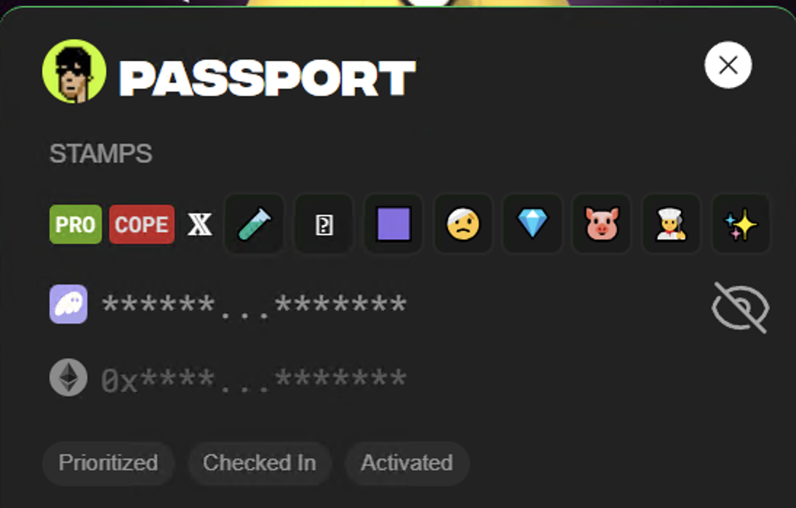
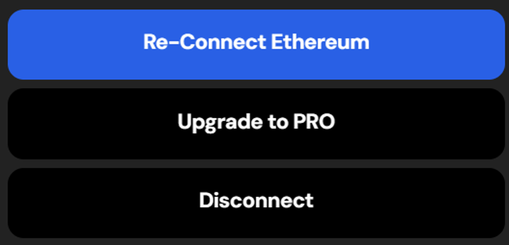

# Passport

( Note - No, I do not have the COPE badge. =) )

## Passport Stamps

| Stamp | Description   |
|---|---|
|PFP | Your PFP will show up at the top left if your X is connected |
|PRO | As long as your PRO is fully active (&lt;30 expiringPro), this will show up. |
| COPE | This pulsating stamp marks the Copers.  Try not to get this one. |
|X | This is supposed to let you know your X account is connected.  This one appears to be broken/backwards.  Having `hasTwitter=false` makes it show up. |

## Badges

The passport will display up to 8 badges.  It will currently be the first 8 you receive.  I imaine it will fit more when someone gets 9.

| Emoji | Name         | Description                                                                 |
|-------|--------------|-----------------------------------------------------------------------------|
| 💎    | Diamond      | Signifies OG status for people who mined/spawned on the original version 1 Eth Pond0x. |
| 🐰    | Void         | Awarded to those who participated in the Void games. Details are limited.   |
| ✨    | Points       | Given to users who engaged with the version 1 Pond0x website over time.     |
| 👨‍🍳   | Chef         | Also given to users of the version 1 Pond0x website for a period of time.   |
| 🐷    | Pork         | Another reward for users of the version 1 Pond0x website.                   |
| ✊    | Stand        | Awarded for signing the Danny petition to get Pauly0x unbanned from X.      |
| 🤝    | Swap         | Given to people who heavily swapped during a specific period.               |
| 🥼    | Insider         | Given to insiders to test and use upcoming features.               |
| 💧    | Water         | Currently unused.               |
| 👑    | King         | Currently unused.               |
| 🦄    | Unicorn      | Currently unused.                                                          |
| ⛏️    | Miner        | Currently unused.                                                          |
| 🥇    | Topswap      | Currently unused.                                                          |
| 🟪    | YGN          | You Get Nothing. Currently unused. Likely for folks who sent eth to the yougetnothing.eth when that campaign (for lack of a better word) was running.  |
| 🤕    | Slashed      | Currently unused.                                                         |
| 🧪    | Spawner      | Currently unused.                                                          |
| 🪷    | Staker       | Currently unused.  |
| 💉    | Covid       | Currently unused.  |
| ?    | Wrapped       | Currently unused.  |
| 🧩    | Quest | Currently unused. |
| 🎁    | Recap | Currently unused. |
<!-- | ❌    | Error 11       | This isn't really a badge, but ~70 people seem to have crossed the line and can no longer participate.  | -->

>Max Rewards\
>Boosts are single use. Boosts increase mining amount. Use one or many at a time. Capture 6 and use them together for maximum boost.

This is what the /players-guide page says, but I don't think it is accurate anymore.

## Lower Stamps

| Stamp | Description |
|---|---|
|Prioritized | This appears if you are PRO with a `expiringPro` value lower than 30 in your manifest. |
|Checked In | This appears when you are fully checked in.  In the code, it is if you have the `test_hash` value in your manifest. |
|Activated | This appears when you are fully activated.  In the code, it is if you have the `miner_hash` value in your manifest. |

## Buttons

The buttons at the bottom of the passport allow you to interact with your credentials.

| Button | Description |
|---|---|
|Connect Solana | This appears if your Solana wallet is not connected properly.|
|Re-Connect Ethereum | Connect Ethereum | This appears if your Eth wallet is not connected properly.|
|Re-link to Pond | Connect to Pond | This appears when your data does not exist yet or doesn't fully load.|
|Upgrade to PRO | This appears if you PRO `expiringPro` number is higher than 30.|
|Disconnect | This will disconnect your wallets so you can connect with another set or reconnect to fix something that may be broken with your current connection.|