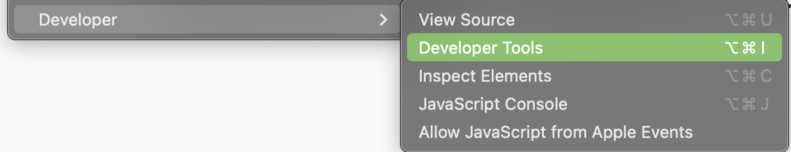
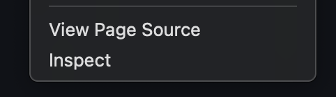
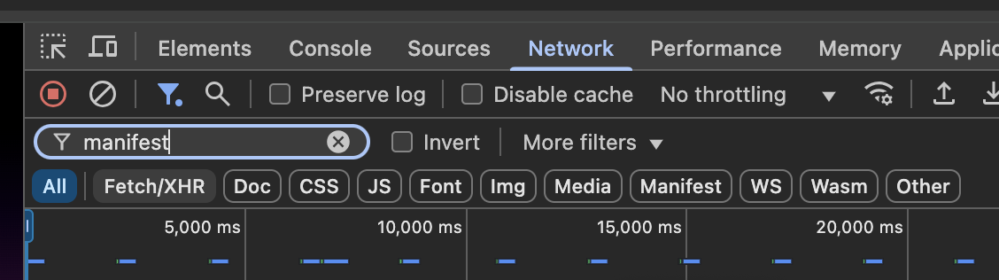
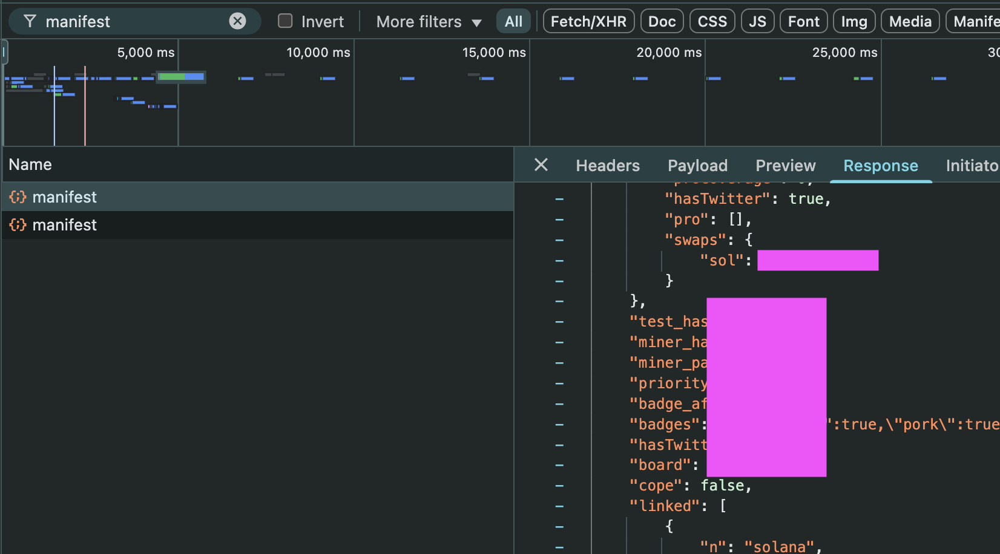

# Your Data

## Manifest

Your manifest contains most of your basic Pond0x account details.

```JSON
{
 "eth": "0x12345xxx",
 "sol": "12345...",
 "checkedin": true,
 "pro_hash": "xx1234",
 "test_hash": "xx5678",
 "miner_hash": "xx9012",
 "miner_pair": false,
 "priority_swap": 12,
 "badge_affirm": true,
 "badges": "{\"diamond\":true,\"pork\":true,\"chef\":true,\"points\":true}",
 "hasTwitter": true,
 "expiringPro": 34,
 "board": 123,
 "cope": true
}
```

eth – Your Ethereum wallet address.

sol – Your Solana wallet address.

checkedin – Boolean for whether or not you are checked in.

pro_hash – (?) The current tx of proving your Pro status.

test_hash – (?) The tx of your test checkin payout.

miner_hash – (?) The tx hash of your selected miner rig. I believe this activatates the "Activated" badge in your passport.

miner_pair – Boolean. Appears to be unused currently. Only ~11 accounts are "true" and the rest are "false". I need to look more into this one.

priority_swap – Your position in the checkin process.
- If you have Pro -> First
- If you are under 1000 -> First
- If you are between 1000-2499 -> Business
- If you are betweel 2500-3999 -> Economy+
- If you are above 4000 -> Economy

badge_affirm – Boolean. I believe this is false by default and turns to true after you teleport your badges.

badges - Json data of your badges. E.g. Diamond:true, Points: true

hasTwitter – Boolean for whether or not you have your Twitter/X account connected.

expiringPro – An integer for your Pro status. I haven't completely figured this one out, but it appears like paying for pro lowers the number and every day that passes increases the number by 1. 1 appears to be the lowest and 100 the highest. I am not sure how a yearly Pro purchases works.
- Under 30 -> Green Pro status
- Between 30-45 -> Yellow Pro status
- Above 45 -> Red Pro status (expired?)

board – An integer between 1 and 147660 (currently). It is not in the same sequential order as the priority_swap boarding number. It displayed on the Mining page for a short period of time, but now it does not appear to be anywhere on the frontend.

cope – This is a unique badge that is separate from the others in the JSON payload. I believe it is potentially temporary where the others are permanent, but I am still looking into a case where either type is lost.

### How To View Manifest

The manifest is a payload that is retrieved on every page load. You can find it in the Inspector on most any browser. 

Note that the inspector has the potential to be dangerous when entering code into the Console, but the Network tab (for the purposes of looking at data) is harmless.

1. Open a new browser window/tab.

2. Open the Inspector. (Generally Cmd+Opt+I or Ctrl+Shift+I or F12 or Right-Click->Inspect or View->Developer->Developer Tools)



3. Click on the Network tab. Search for manifest. (Note that there is a filter button for Manifest. Do not use this.)


4. Go to https://www.pond0x.com (or whichever you use). If you are already there, refresh the page.

5. You should now see an entry for manifest. Click on "manifest" and click on "Reponse" in the tab that opens up.
