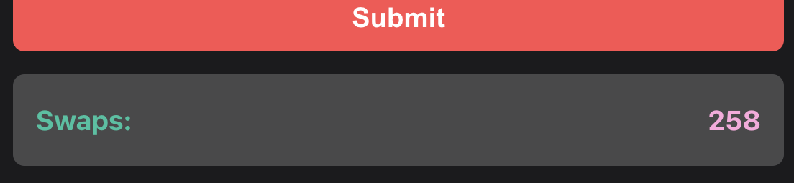
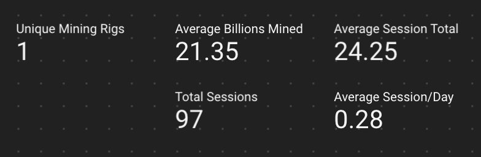

import { BoostCalculator } from "@site/src/components/MiningData";

# Swap/Boost Data

This calculator is used to determine how to reach 615 boost via Swaps. (Previously 415/515)

Enter your current Mining Sessions and Swaps.

<BoostCalculator />

## Data

**Total Swap Boost** - The total amount of Boost you have gained from Swaps. (Swap Count \* 1/6). Note that this does not include purchased boost, Badge boost, etc..

**Total Session Boost** - The total number of Boost you have used via Mining Sessions (Mining Session \* -3).

**Current Boost** - Total Swap Boost minus Total Session Boost.

**Swaps Needed for 615** - If your Current Boost is below 615, this is the number of Swaps you need to get there.

**Sessions until 615** - If your Current Boost is above 615, this is the number of Sessions you have until your Boost is below 615.

**Sessions until 0** - If your Current Boost is below 615, this is the number of Sessions you have until your Boost is below 0.

## Notes

### Calculator

This calculator currently only takes into account Swap Boost and Session Boost, so it is missing Badge Boost and Purchased Boost (along with anything else that might affect boost).

Here is the formula, as far as I know.

Initial Rig Boost\
\+ Teleported Badge Boost\
\+ Purchased Boost\
**+ Swap Boost (1/6th per swap)**\
**- Mining Session Boost (-3 per session)**\
-----\
= Current Boost

### Where Is My Data?

To get your Swap Count data, please check the [Manifest Tool](/docs/info/manifest) page and search for your wallet.

To get your Mining Session data, please check the [Dashboard](/dashboard) page in the Mining Aggregate tab and search for your wallet with the filters on the top.

However, note that my data is not 100% exhaustive. It only goes back to Nov 11 and missed a couple days in December when my computer died.

I added a column for "Average Sessions Per Day" to help you estimate your Sessions if you started prior to Nov 11. Simply multiply (Avg Session/Day \* Days Mining (you will need to calculate this number, the one on the dashboard only goes back to Nov 11 as well)).

( https://www.timeanddate.com/date/duration.html Is a good tool to calculate days. I may add this to my calculator sooner or later. )

E.g.

Let's say the data above is what you are using and you started Oct 1. As of today, that is 165 days.

165 \* 0.28 = 46

Enter 46 and 258 into the Calculator and it says you need about 4260 swaps to get to 615. (Again, not taking into account initial, badge, or purchased boost, so it should be sooner).
