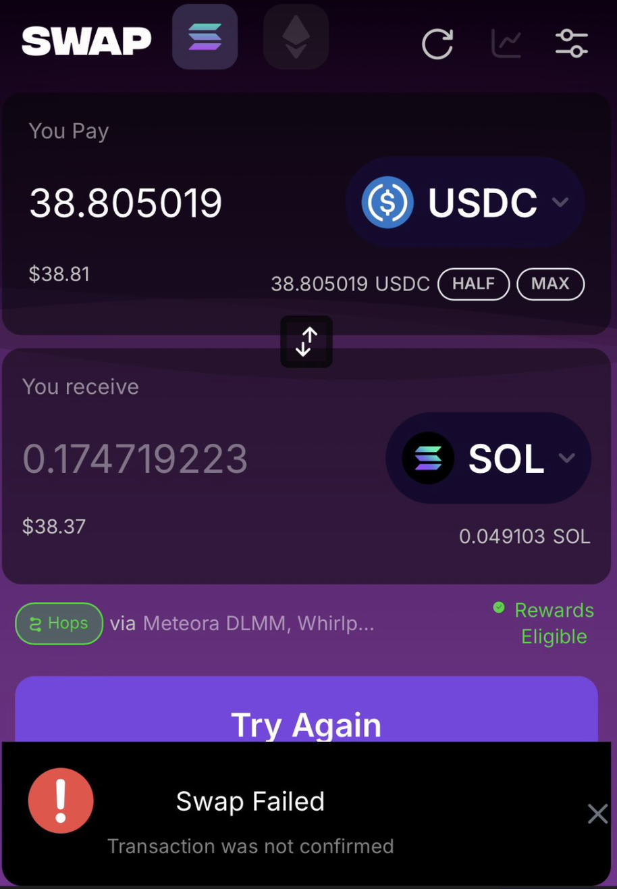
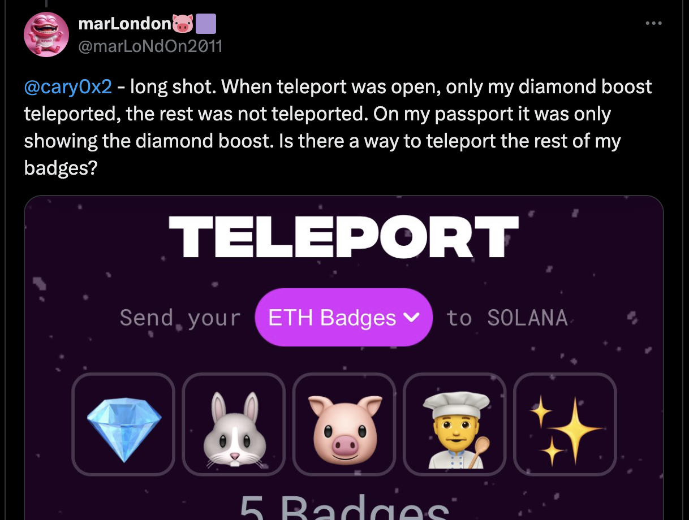

# Issues

No system is perfect, and this is no exception. It is a work in progress and has a few quirks. Most of them have reasons and most of them have solutions or workarounds.

Please send me any unique issues you may have along with any details and/or solutions.

## Swapping

After each swap, it will often say "Swap Failed, transaction not confirmed." However, this appears to be a bug. The transactions do go through. You may have to wait a few seconds to see it update.

## Teleporting

Here is an interesting issue. I confirmed that he has the badges on his Eth Wallet and only the Diamond is in his Pond0x account. I hope this one gets addressed.

I am not sure I have a solution for it. My suggestion is to make sure the badges that show up on this page match up with what you are expecting before clicking the send button.

## X Connection Failures

Connecting to X is a part of the Check In process. I have heard some reports of people claiming to check in with X and then find that their account is not connected. 

I am still digging into this one. It seems like there are a few variations of it.

