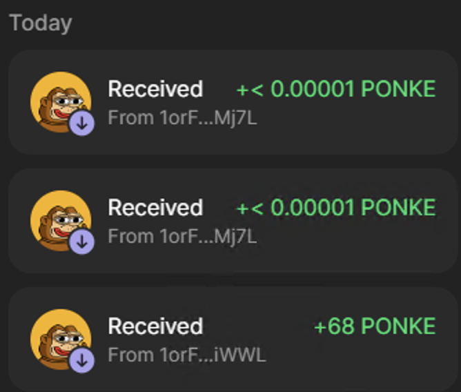

# Common Scams

There are countless scammers out there waiting for you to make the wrong more.  One bad click can drain your entire wallet.  

Here is a list of the common scams out there.  Please let me know what else exists so I can add it.

## General Tips

- Always double-check URLs for official sites.
- - If you were connected before, but you aren't connected now, you are probably on a scam site.
- Never share your seed phrase or private key with anyone.
- - "But what about..." No. Never.
- Use password managers to avoid typing errors that lead to fake sites.
- Enable two-factor authentication (2FA) where possible.
- Get extremely familiar with the sites you use most often.  Read the transaction messages– every single word.  Understand the message.
- Practice running through all of the steps you may need to do in a high-pressure situation.  If you are planning on moving $10k quickly in the future, practice with $10 several times.

## Phishing

Scammers will impersonate trusted figures/platforms in an attempt to get you to click links to their website.  These website often look legitimate or exact copies of the ones you know.

Prevention Tips:

- Verify the sender. Check their @ address, their folower count, etc.
- - Note that even trusted figures can get hacked and send out bad links, so don't even blindly trust them.
- Verify the transaction before accepting it.  If it looks off, don't do it.

## Addres Poisoning

Scammers will create wallets with extremely similar wallet addresses in the hopes that you interact with them instead of the legitimate wallet.  For example, they will send you tokens immediately after receiving tokens from the legitimate wallets with the hope that you will send tokens to the wrong address.

Here is an example of it happening with the swap reward address:

