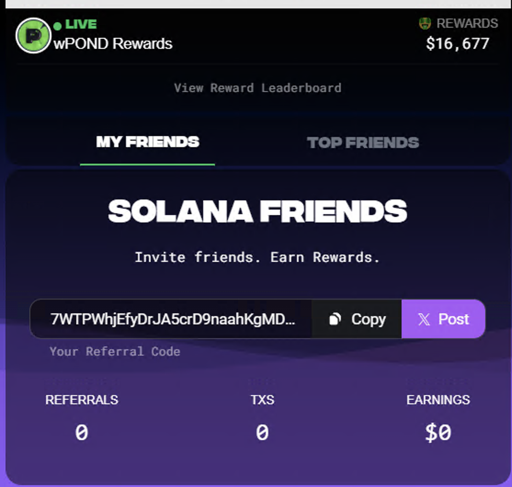
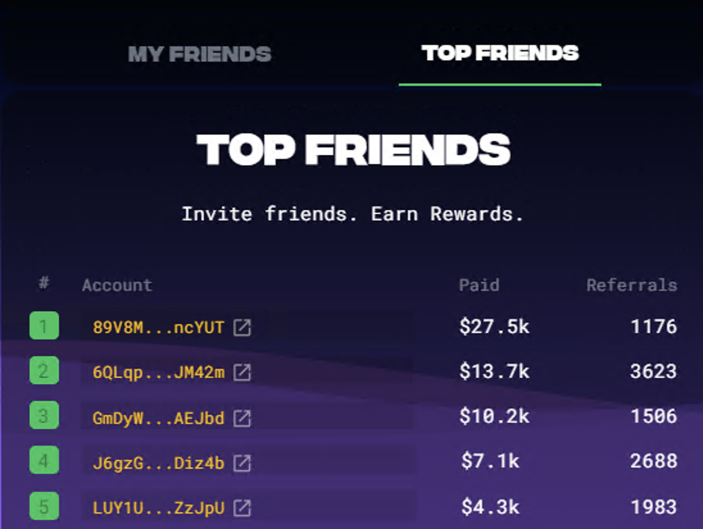

# Friends

>**Earn Rewards**. When your friends swap.\
>**Earn Rewards**. When your friends mine.\
>**Use Link**. Get rewarded when others use your link.

---

>**What do I win?!**\
>You win a portion of the Rewards won by those you referred directly and those referred by your directs >(associates).\
>Build a bigger network, get bigger rewards! 🚀\
>Example 1: You refer Geoff (direct), you get a portion of his Rewards.\
>Example 2: Geoff refers Matt (associate), you get a portion of Geoff's and Matt's Rewards.

>**How do I use referral links?**\
>Share your Ref link far and wide!\
>Get people to swap using your link.\
>Build a really big team! WIN. 👑

>**Are the rewards sent automatically?**\
>Yes, after the required confirmations are completed on-chain, Rewards are automatically distributed to the user and referral (when applicable).

---

## My Friends

This tab will supply you with your friend referral code / link.  Share this with your swapping friends to share wins.  More friends -> more wins. I recommend always using a referral code when you swap. If you need one, you can [use mine](/tips) =).

It will also show you your number of referrals, transactions, and earnings. These are not updated instantly and often take some time to load in.

## Top Friends

This tab will show you the top paid and top referred accounts.