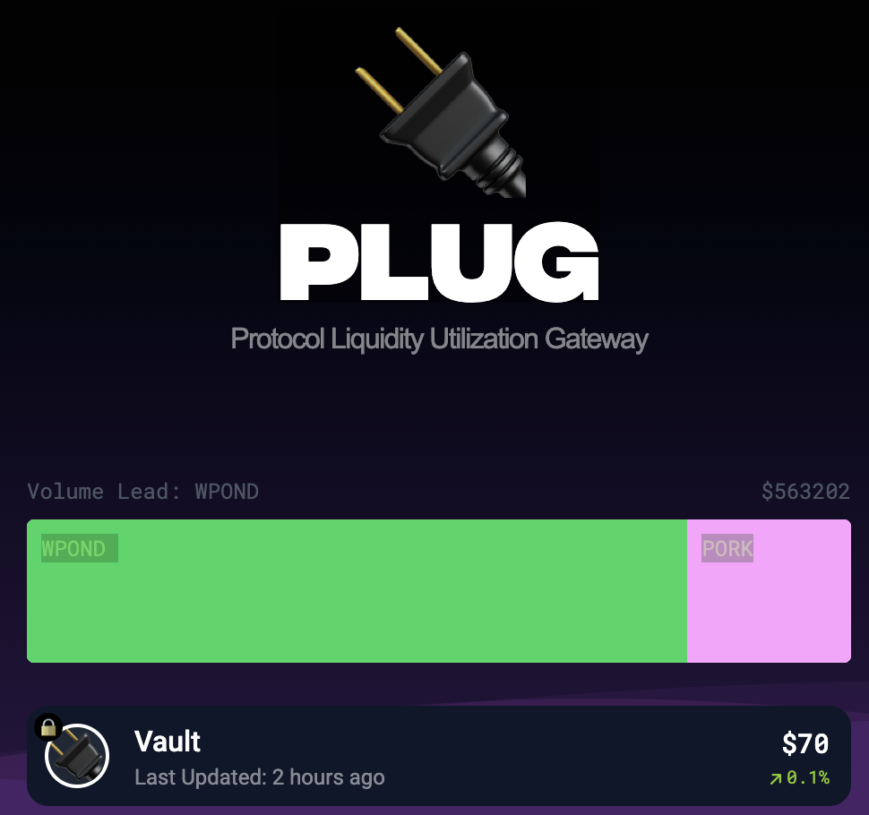

# Plug

>Protocol Liquidity Utilization Gateway

This feature is not yet linked from anywhere in the website, but you can find it here:

https://www.pond0x.com/plug

>**What is PLUG**?
>PLUG is a first of its kind multi chain vault that actively participates in the market, injecting liquidity directly into the chart by providing LP, trade mining fees and purchasing POND ecosystem tokens directly.