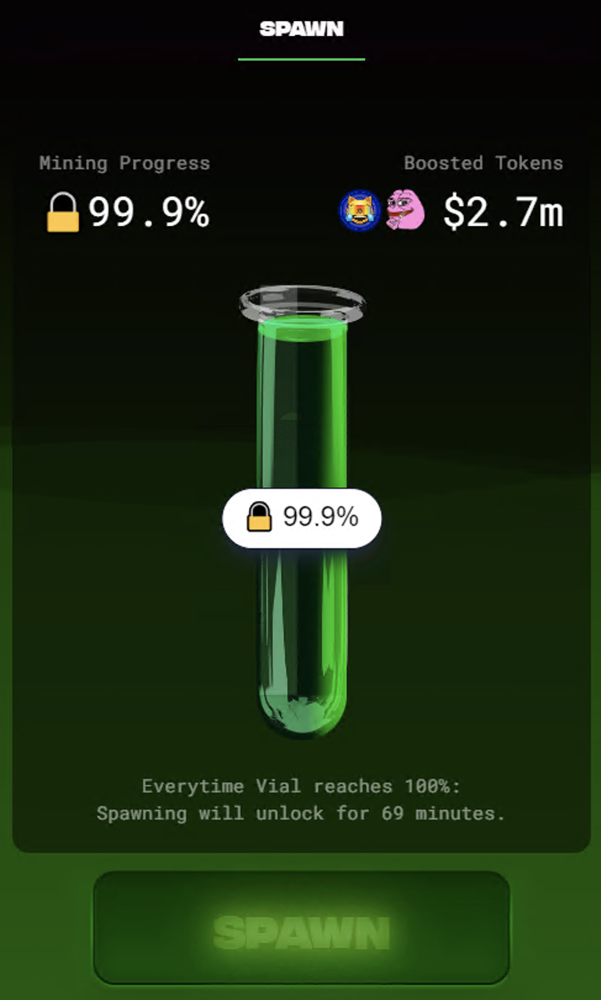
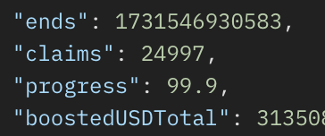
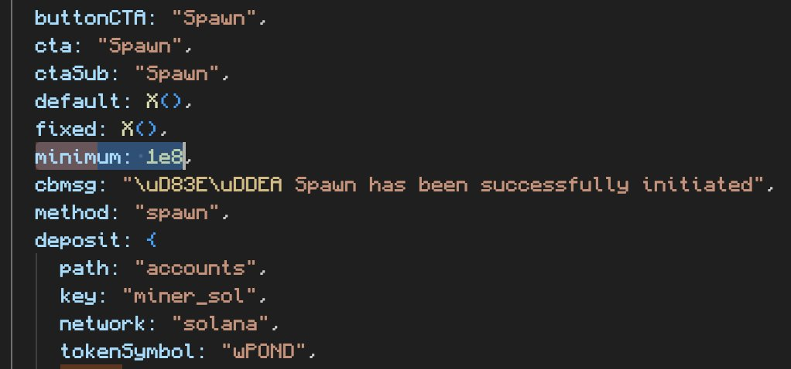

# Spawn

>**Spawn on Solana**. Spawn your PNDC. Get PEPE, PORK, MOG and more\
>**Use Link**. Get rewarded when others use your link.

This feature is not yet available. It will convert wPond into the leaderboard mined token(s).

We are told it will start when we hit 25,000 claims.  We are currently at ~24,996 – 99.9%.

(Note that this number is according to the API)

We are told that once it starts, it will happen at every 5,000 claims.

The Dune Dashboard has us at over 36,000 claims, so this should imply that there will very quickly be 3 more spawns after the first one.

From what I can tell, this curve represents awards which implies that the first few will giga win.

>**What is Spawning?**\
>A way to turn your mined activity into other tokens.\
>Spawning is not a swap.

>**How can I be prioritized?**\
>Priority is first come, first serve.\
>Optional tips increase priority. Tips are shared to Pondwater.

>**How do I choose which token I receive when spawning?**\
>You do not choose. You get whichever token has the highest supply at the time of your spawn.

>**What tokens can I get for Spawning?**\
>You get whichever available token has the highest supply.\
>Advanced:\
>Spawning runs on a registry. Tokens in the registry are liquidity mined proportionate to the weight of their registered PNDC.\
>Every 1T PNDC used to register a token receives ~5% of the mined liquidity during that mining cycle. (i.e: 3.25T PNDC used to register BTC, results in ~15.75% of mining directed to BTC. The BTC can be spawned when that mining cycle ends. The BTC will not be mined in the next cycle unless its registered again.)

## Info

Spawn appears to have a minimum of both 100M and 500M, so one will or the other will change.

Spawn will only let you select 25%, 50%, or 100% of your wPond to transact. If any of these results in under 100M, it will not work.

