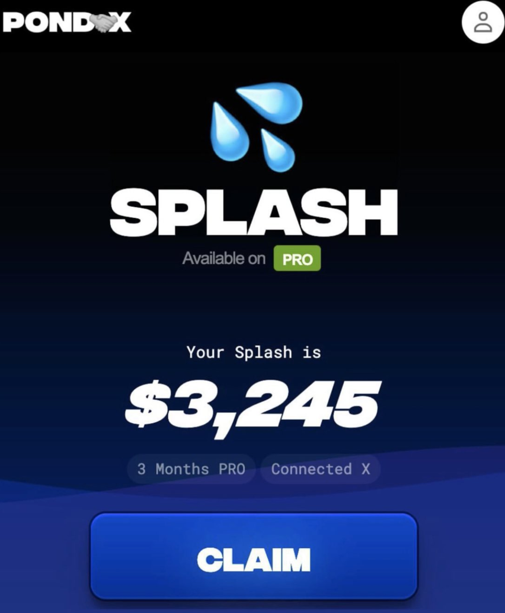
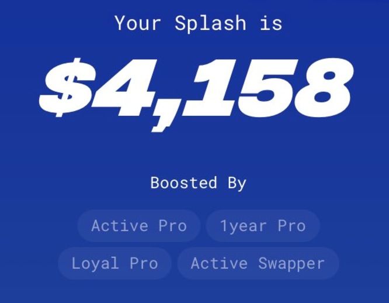
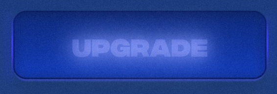
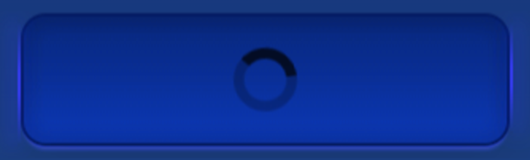
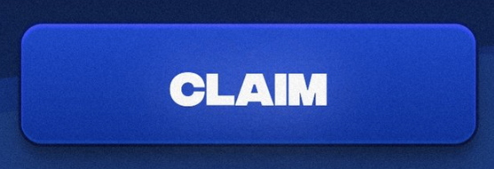
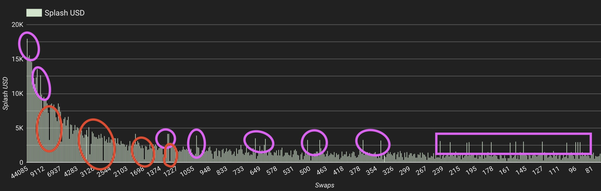

# Splash

Splash is a features on Pond0x that rewards users for participating. Having PRO, Connecting X, Actively Swapping, Loyal Pro, 1Year Pro, and other engagements with the ecosystem all seem to affect the payout. I have seen them as low as a few dollars and as high as tens of thousands. It requires a free Sol signature and then the $PORK gets sent to your linked Eth wallet.

## How To

It seems to work like this– Loading the page should populate all of your "Boosted By" attributes and a button. The button has many states. The state of the button can change as new data is loaded in every few seconds, but sometimes it seems to get stuck.

Upgrade – I believe this one shows up when you still need to purchase PRO.

Loading spinner - If this does not resolve after ~1 minute, you likely need to refresh.

Ended – This seems like the default state before you have any interaction. When a new bundle is ready to be filled, this will turn into "Claimed."

Claim – This will open a prompt to sign the Sol message to start the process.

Broadcasted/Bundling – This means your signature was accepted and you should be in the queue for the next send. However, please note that this can sometimes revert, so you may need to do it again.

Claimed – This is the final state. It comes with confetti and means your wallet should have the tokens.

## Evaluation

There are two key factors to getting as much from Splash as possible– Pro and Swaps. Every additional month of pro goes up step. The 1-year pro users are the purple outliers. The red outliers are folks who either did not have pro at all or let it expire before Splash.

## Info

Here is the wallet sending out the $PORK. [0x81ce2389b80ed3d24c84f3f9e9ae6044d9b86437#tokentxns](https://etherscan.io/address/0x81ce2389b80ed3d24c84f3f9e9ae6044d9b86437#tokentxns)

Splashes are bundled in groups of 25. Mining is mandatory for Splash to work. More mining power will pre-validate more Splash bundles.

It seems to be most successful when you refresh immediately after a batch of transactions goes out.

## FAQ

>**What is Splash?**\
>An airdrop reward system for PRO users.

>**Why does it say "Refueling"?**\
>Splashing periodically becomes unavailable during congestion or refueling.