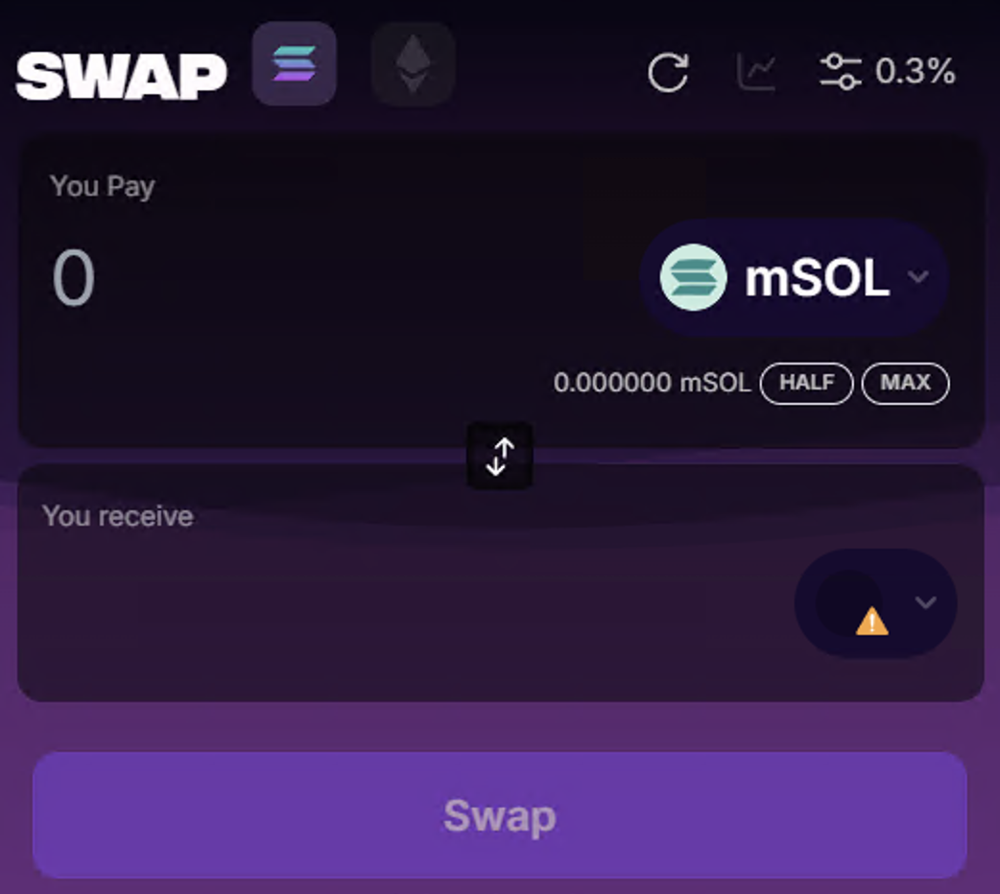
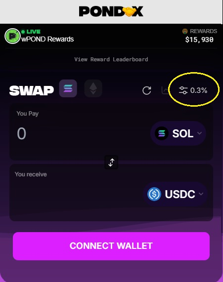
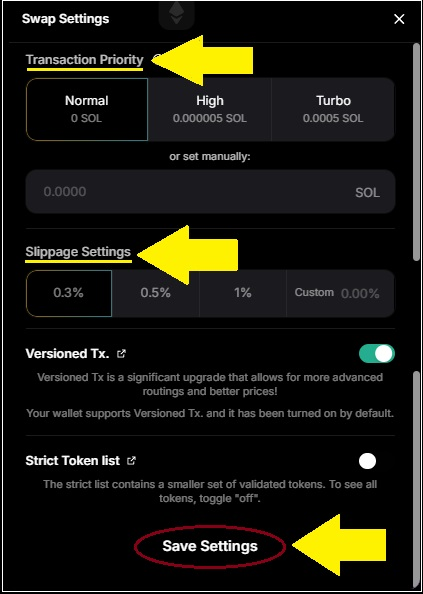

# Swap

>**Swap on Solana**. Real time rewards.\
>**Swap on Ethereum**. More swaps. More Drops.\
>**Use Link**. Get rewarded when others use your link.

The Pond0x Swap is among the best of its kind.  It is a fairly curated list of Solana tokens.  It has a small fee that gets pumped into the reward pool and paid out for paticipating.  Continued mining will increase your boost as well as make you eligible for rewards.

You can also use ref codes to share rewards with your friends.

### Slippage

Slippage occurs when there is a discrepancy between the intended price and the actual price due to market volatility, low liquidity, or other factors.

If you’re noticing that your transactions are struggling to execute successfully, consider adjusting both the slippage and/or priority settings.  The higher the slippage, the more likely it will go through, but the swapped result may be higher or lower than expected.

Don't forget to Save Settings once they have been adjusted. 
