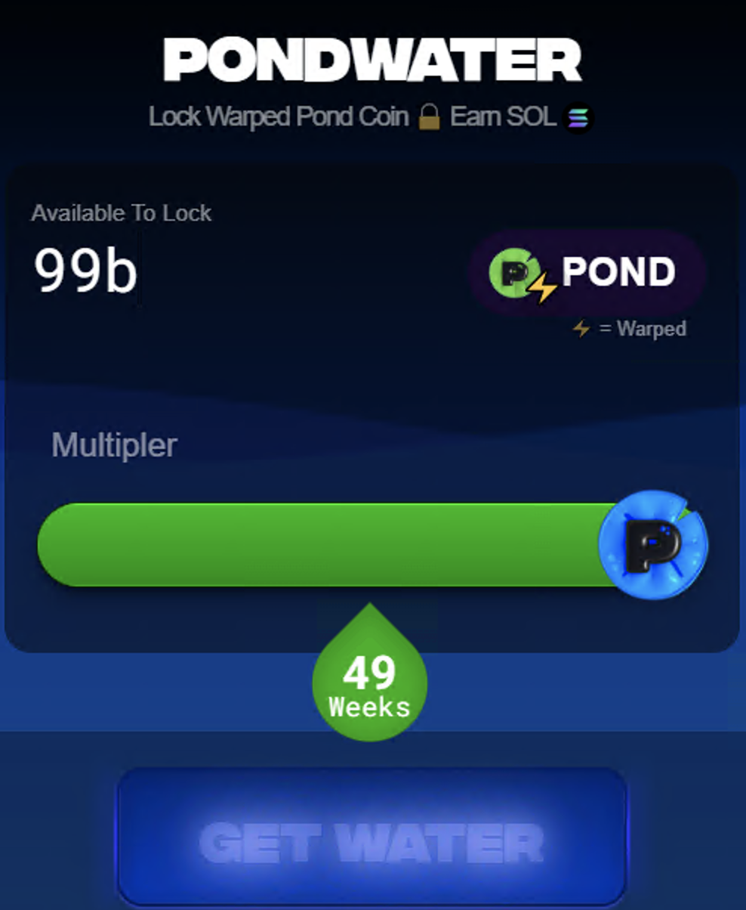
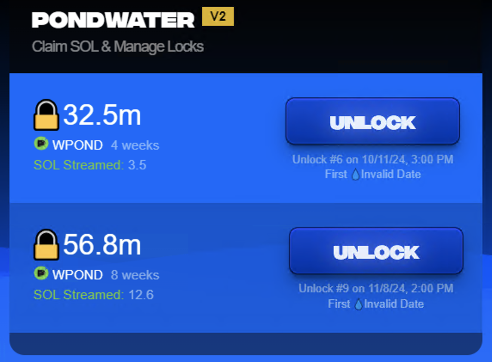

# Water

>**Get SOL**. Lock PNDC, earn SOL from mining, LP and swaps.\
>**Flexible**. Unlock Anytime. No contract locks.\
>**Boost**. Lock longer, earn more SOL.

## Lock

This feature is not yet available.  This feature will allow you to lock your wPond for several weeks and yield Solana over time.

>**How does it work?**\
>Lock warped ⚡️ PNDC and receive SOL streamed to your address automatically.\
>⚡️ = Warped

>**What is the multipler?**\
>The longer you lock, the greater multipler of SOL you receive.\
>Once your lock period expires, you no longer receive SOL.

>**Can I unlock any time?**\
>Yes, you can unlock at any time.\
>If you unlock before your lock expires, a slashing penalty is applied. The slashing penalty is calculated by the amount of remaining days your lock has multipled by 2.

>**Can I lock more than once?**\
>Yes, you can lock as many times as you would like. Each lock is treated independently.

>**Why is amount available to lock lower than my balance?**\
>The amount you can lock is determined by the history of Pondwater.\
>Mining activity determines how much you can lock.\
>Miners are able to lock a larger amount.

## Claim

>**Can I unlock any time?**\
>Yes, you can unlock at any time.\
>If you unlock before your lock expires, a slashing penalty is applied. The slashing penalty is calculated by the amount of remaining days your lock has multiplied by 2.

>**Can I unlock any time?**\
>Yes, you can unlock at any time.\
>If you unlock before your lock expires, a slashing penalty is applied. The slashing penalty is calculated by the amount of remaining days your lock has multiplied by 2.