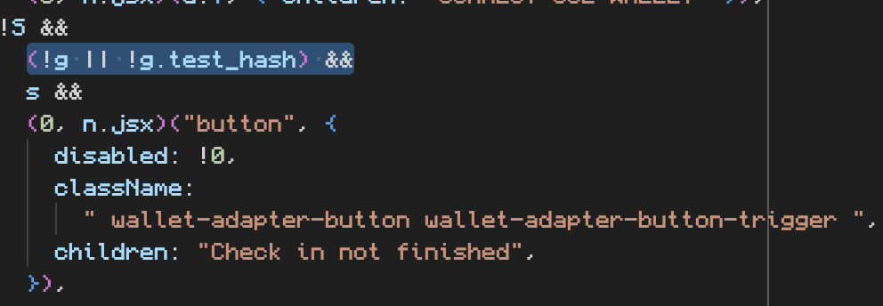

### Not Receiving Test Transaction

The test transaction was used early on to verify the connections were working as intended.  You should not need to complete this step in order to participate in the ecosystem.

However, it is certainly an issue because the test_hash is a requirement to teleport badges.

