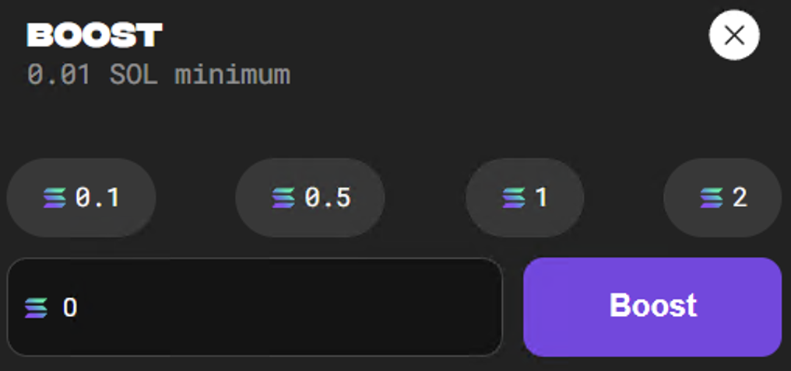
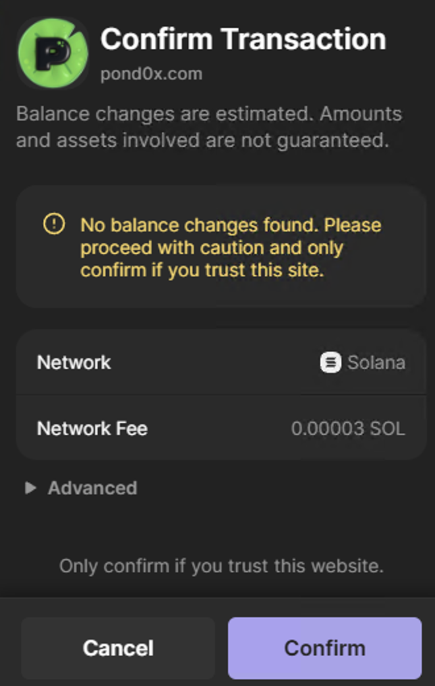

### Not Receiving Claims

This is **not** an issue.  Claims are currently in a queue and that queue is currently very slow or paused.  It will continue and send out much quicker once launch/spawn occurs.

Note that there is no way to see the entire queue.  Once the Node image is released and I have access to the queue data, I will make sure it is released as soon as possible.

### Mining "Stuck" at 1.6M

Mining will sometimes start, show hash, show the cryptography animation, and appear to be working, but then stick at 1.5M forever.  This was much more frequent early on, but does happen from time to time.  I believe this is when the backend collecting these hashes is in maintenance mode.  

Check the TL.  People call this out very quickly and will also mention when it starts working again.  You can also check Magick's visualization tool, but DYOR and click links very carefully.

Hopefully, there will eventually be a UI element to warn you about maintenance/downtime.

### 0 Boost Purchase

While mining, and maybe in other situations, you are able to purchase 0 boost despite it saying 0.01 minimum.

### XHR and WSS Feed Differences

The mining data between the two feeds seems to be much different.  This causes the mining screen to flash between 0 and # boost, different amounts of unclaimed, etc.

