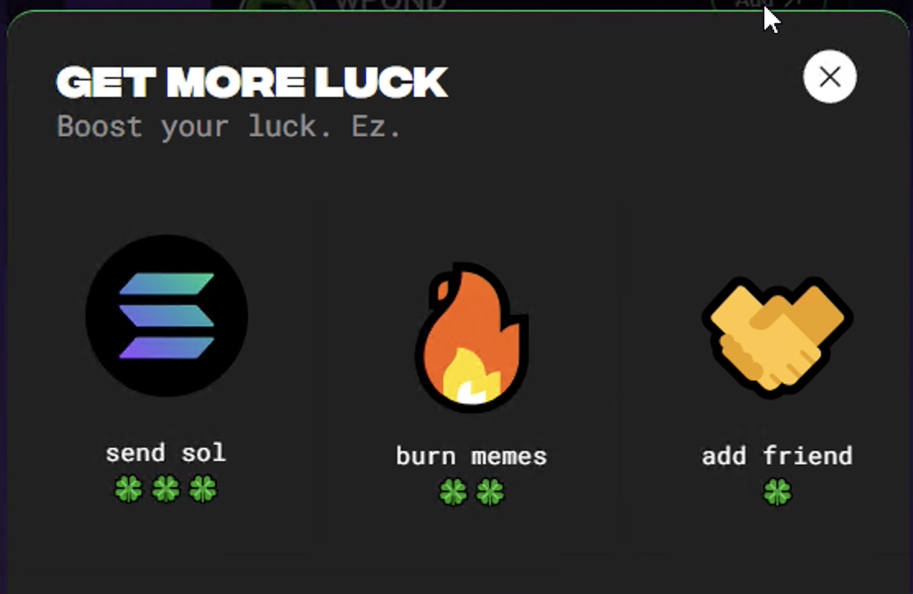
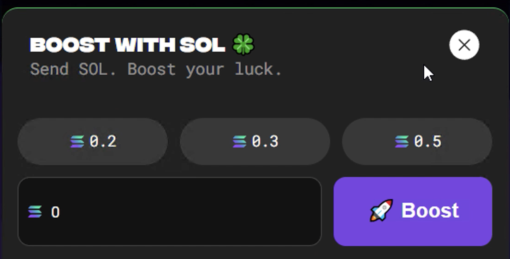
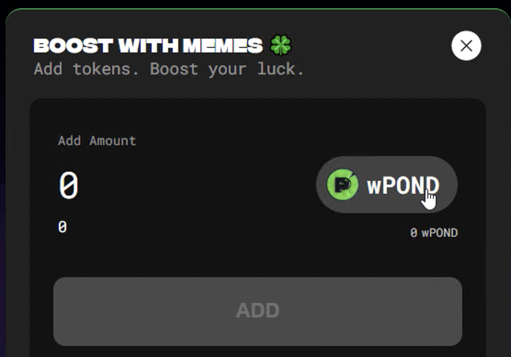
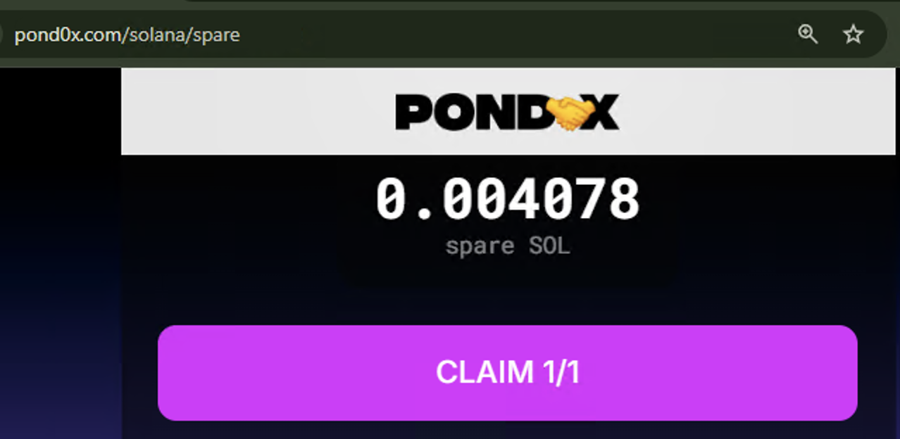
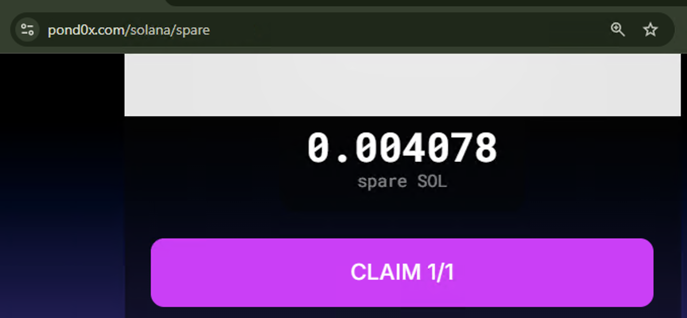
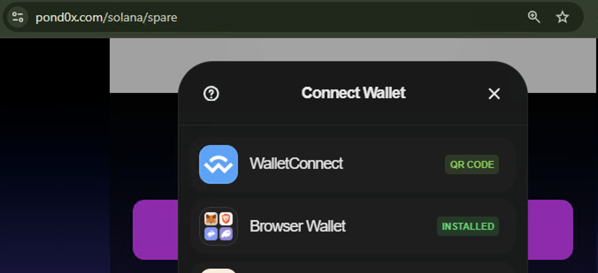

### Leaderboard Purchase Modal

When you click the `Add` button on one of the tokens on the Leaderboard tab, the modal cycles between\
`GET MORE LUCK` -> `BOOST WITH SOL` -> `BOOST WITH MEMES`

It will often not have an accurate value of the tokens available to burn.

### ~~/Spare Logo Disappearing~~ Fixed

~~On the claiming spare Sol page, if you use Tab a few times, the logo disappears and clicking the empty space opens the wallet connect menu.~~

<!-- 

 -->

### Luck Calculations

It appears as though if you buy luck, it only counts your latest purchase.  E.g. If you buy up to 9 luck, and then try to buy more, it could go down to 8.  If you want to get up to 10 luck, do one big purchase and stop.