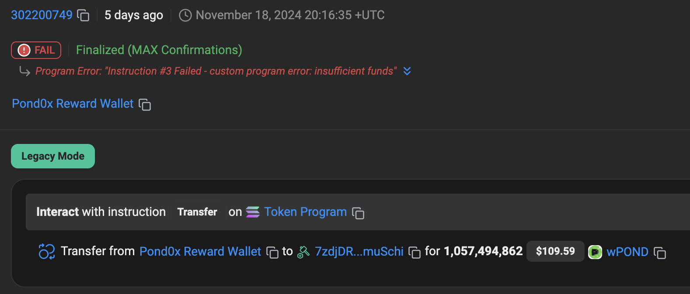

### ~~Swap "Failures"~~ Fixed

<!--  -->

~~After each swap, it will often say "Swap Failed, transaction not confirmed." However, this appears to be a bug. The transactions do go through. You may have to wait a few seconds to see it update.~~

### Insufficient Funds Swap Reward

It appears like some of the swap reward payouts do not go through because of insufficient funds.  I would like to see these get re-sent later when the funds are available.

E.g. 
https://solscan.io/tx/P5Kg4x53NHnR41wffNY1S7C2VAPkFsXrdWz7FNzdorjWZNUCAyS6PBHBR4u2qyfUAFs35StcNyn3AajKPLiciXM

### ETH Swap Not Working

I am getting several reports of ETH swaps not working.  Some say MM wallet works and Phantom doesn't.  I do not have the spare ETH for transaction fees to test this, but I believe it due to the large number of reports.

### Bridge Page Inaccessible

https://www.pond0x.com/bridge

The bridge page works and users still use it, but there is no link for it. If this is meant to be used, add a new link onto the homepage cards or remove the page entirely.