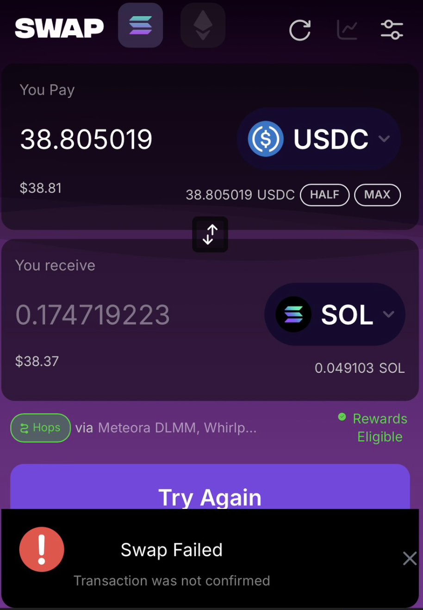

### Swap "Failures"

After each swap, it will often say "Swap Failed, transaction not confirmed." However, this appears to be a bug. The transactions do go through. You may have to wait a few seconds to see it update.