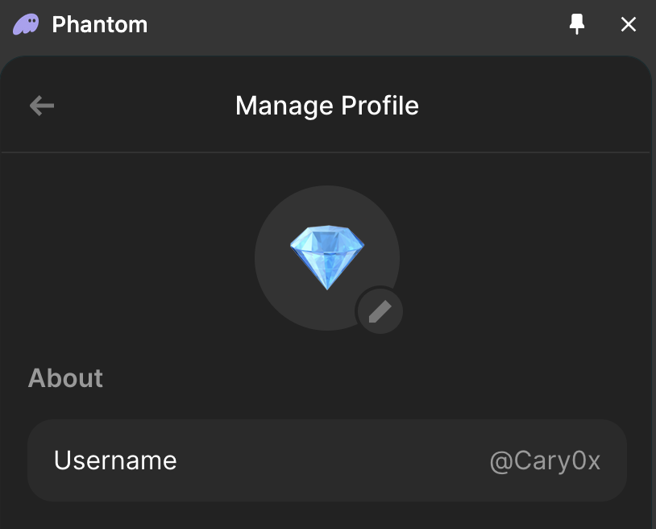

# 🌱 Support Cary0x’s Community Contributions

Welcome, Pond0x community! As you know, I'm here to keep you up-to-date with clear, objective information about Pond0x, its latest code developments, and what they might mean for us all. My work isn’t official—just a personal effort to help cut through uncertainty and keep everyone informed.

### 🌌 Why I Do This

In this space where updates can be frequent and speculation runs high, I aim to provide honest insights that you can count on, whether it's about mining, spawning, swapping, or any of the other facets that make Pond0x unique. Staying grounded in facts has helped keep our community hopeful, optimistic, and moving forward—no matter what.

---

## 💡 How You Can Support

I want to be clear: I don’t expect or ask for anything in return. This work is a way for me to give back to a project I believe in, and I’ll continue to do it regardless of tips or recognition.

However, if you'd like to support this work, your contribution will go toward tools and resources that make my analysis and guides even better. Your tip, no matter the size, is a quiet encouragement to keep at it.

### Pond0x Referral Swap:

[Cary0x2 Swap Ref](https://pond0x.com/swap/solana?ref=7WTPWhjEfyDrJA5crD9naahKgMDKQUqoXTMpLW4T3kkGkmUFVWsFj2opZoM)

You can also support me by [swapping on my friends](/community#the-pond).

### SOL Wallet:
CgEj6KBubTEvZxq5aHHyeUkVcJuQRfw24ghzB6eJeNnh

### ETH Wallet:
0xe1c11B7B31a27aC280A3dD2C4DDB4394ceC2916C

### BTC Wallet:
bc1qy4pgvjdp3umlnm67n532xlq6xdcz4tdawx4e05

Phantom Account: @Cary0x (it should be linked to the addresses above)

---

## 🛠 What Your Tip Enables

- **Deeper Code Analysis**: Access to tools that let me dig deeper and offer more comprehensive insights.
- **Documentation and Guides**: Expanding helpful resources that make Pond0x features more accessible.
- **User Issues and Optimism**: Keeping up with community questions and clarifying “mysteries” that sometimes cause doubt or frustration.
- **Sharing With Community**: I will share tips with community members who deserve it as much or more than myself.

---

## 🙏 Thank You, Pond0x Community

Whether you support with a tip or just by following my updates, I’m truly grateful for this community and your trust in the work I share. My goal is to make Pond0x a project we all feel excited about, even on uncertain days. Let’s keep building a positive space for everyone—thank you for being part of it.

— **Cary0x**